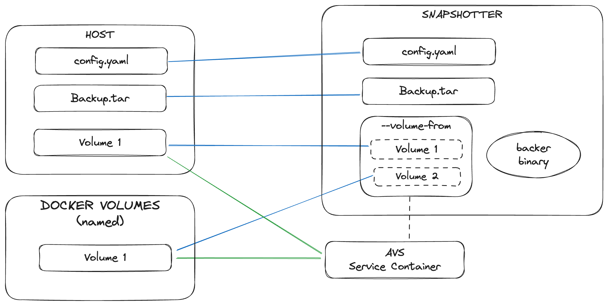

# Docker Volumes Snapshotter

The snapshotter project was created to fulfill the requirement of saving all the volumes of a Docker container to a tar file, which can be restored at a later time. By properly configuring it, volumes from different containers can be saved in the same tar file.

> The tar file can either already exist or be empty. An empty tar file is not a zero-byte file. To understand this better, refer to the [Initialize `tar` file](#initialize-tar-file) section.

The snapshotter container should run with the same volumes as the container whose data should be saved. One way to achieve this is by running the snapshotter container with the `--volumes-from` flag.

- [Docker Volumes Snapshotter](#docker-volumes-snapshotter)
  - [Build snapshotter image](#build-snapshotter-image)
  - [Backup](#backup)
  - [Restore](#restore)
  - [Configuration file](#configuration-file)
    - [Passing the configuration file](#passing-the-configuration-file)
    - [Configuration format](#configuration-format)
    - [Example](#example)
  - [Backup file](#backup-file)
    - [Initialize `tar` file](#initialize-tar-file)
      - [Using the `backuptar` package](#using-the-backuptar-package)
      - [Using a CLI command](#using-a-cli-command)
    - [Passing the backup `tar` file](#passing-the-backup-tar-file)



## Build snapshotter image

```yaml
docker build -t snapshotter:v0.2.0 github.com/NethermindEth/docker-volumes-snapshotter.git#v0.2.0
```

## Backup

To backup volumes from a Docker container use the `backup` command, [bind-mount](https://docs.docker.com/storage/bind-mounts/) the volumes, [configuration file](#configuration-file) and the [`backup.tar`](#backup-file) file.

```bash
docker run \
  --rm \
  --volumes-from <container> \
  -v $(pwd)/backup.tar:/backup.tar \
  -v $(pwd)/config.yml:/config.yml \
  eigenlayer-snapshotter:v0.2.0 backup
```

> Replace the `<container>` placeholder with the name or id of the container whose volumes should be saved.

## Restore

To restore volumes of a Docker container use the `restore` command, [bind-mount](https://docs.docker.com/storage/bind-mounts/) volumes, [configuration file](#configuration-file) and the [`backup.tar`](#backup-file) file.

```bash
docker run \
  --rm \
  --volumes-from <container> \
  -v $(pwd)/backup.tar:/backup.tar \
  -v $(pwd)/config.yml:/config.yml \
  eigenlayer-snapshotter:v0.2.0 restore
```

> Replace the `<container>` placeholder with the name or id of the container whose volumes should be saved.

## Configuration file

### Passing the configuration file

The snapshotter process requires the configuration file to be located at the `/config.yml` path inside the container. Therefore, the recommended way to pass the configuration is by mounting the following volume:

```text
--volume <path-to-config>:/config.yml
```

Replace `<path-to-config>` with the absolute path to the configuration file on the host machine.

### Configuration format

The snapshotter does not need too many configurations, only two options are necessary:

1. `prefix`: is the prefix path to store the volumes inside the backup tarball file
2. `volumes`: list of volume targets inside the container, should be absolute paths to a directory or a file inside the container

### Example

Give the following directory structure in the host machine file system:

```text
test-volumes
├── volume1
│   └── file.txt
├── volume2.txt
└── volume3
    └── file.txt

3 directories, 3 files
```

If the a Docker container is created using the following command:

```bash
docker run \
  -v $(pwd)/test-volumes/volume1:/home/volume1 \
  -v $(pwd)/test-volumes/volume2.txt:/home/volume2.txt \
  -v $(pwd)/test-volumes/volume3:/home/volume3 \
  busybox tree /home
```

The output should be the following, showing the file system structure inside the container:

```text
/home
├── volume1
│   └── file.txt
├── volume2.txt
└── volume3
    └── file.txt

2 directories, 3 files
```

Checking existing containers, the container name is `busy_lewin`:

```bash
$ docker ps -a
CONTAINER ID   IMAGE     COMMAND        CREATED         STATUS                     PORTS     NAMES
9c4324261041   busybox   "tree /home"   8 seconds ago   Exited (0) 7 seconds ago             busy_lewin
```

Checking container volumes:

```bash
docker inspect \
  --format='{{range .Mounts}}{{print .Source}}:{{println .Destination}}{{end}}' \
  busy_lewin
```

The output should be:

```text
/abs/path/test-volumes/volume3:/home/volume3
/abs/path/test-volumes/volume1:/home/volume1
/abs/path/test-volumes/volume2.txt:/home/volume2.txt
```

Finally, to backup the volumes of the `busy_lewin` container, the following configuration file could be used:

```yaml
prefix: "volumes/busy_lewin"
volumes:
  - /home/volume1
  - /home/volume2.txt
  - /home/volume3
```

> The `prefix` path is relative to the root of the tar file. The `volumes` paths
> are absolute and equal to the `Destination` part of the mounts  of the `busy_lewin` container.

## Backup file

### Initialize `tar` file

The backup tar file must not be empty; it must end with 1024 zero bytes. These zero bytes consist of two empty blocks of 512 bytes each, which define an end-of-archive, as specified in the spec. This requirement is necessary to enable the appending of files to existing tar files that contain volumes from other containers but are located at different paths within the tarball.

The initialization of a backup tar file involves creating a file with a `.tar` extension, with the content being 1024 zero bytes.

#### Using the `backuptar` package

The backup tar file could be initialized using the `InitBackupTar` in the `[backuptar](https://github.com/NethermindEth/docker-volumes-snapshotter/tree/main/pkg/backuptar)` package. For instance:

```go
package main

import (
 "fmt"
 "io"
 "log"
 "os"

 "github.com/NethermindEth/docker-volumes-snapshotter/pkg/backuptar"
)

func main() {
 err := backuptar.InitBackupTar("backup.tar")
 if err != nil {
  log.Fatal(err)
 }

 backupStat, err := os.Stat("backup.tar")
 if err != nil {
  log.Fatal(err)
 }

 fmt.Printf("Backup size: %d\n", backupStat.Size())

 backupF, err := os.Open("backup.tar")
 if err != nil {
  log.Fatal(err)
 }
 defer backupF.Close()

 backupData, err := io.ReadAll(backupF)
 if err != nil {
  log.Fatal(err)
 }

 fmt.Printf("Backup data:\n%v\n", backupData)
}
```

```text
Backup size: 1024
Backup data:
[0 0 0 0 0 0 0 0 0 0 0 0 0 0 0 0 0 0 0 0 0 0 0 0 0 0 0 0 0 0 0 0 0 0 0 0 0 0 0 0 0 0 0 0 0 0 0 0 0 0 0 0 0 0 0 0 0 0 0 0 0 0 0 0 0 0 0 0 0 0 0 0 0 0 0 0 0 0 0 0 0 0 0 0 0 0 0 0 0 0 0 0 0 0 0 0 0 0 0 0 0 0 0 0 0 0 0 0 0 0 0 0 0 0 0 0 0 0 0 0 0 0 0 0 0 0 0 0 0 0 0 0 0 0 0 0 0 0 0 0 0 0 0 0 0 0 0 0 0 0 0 0 0 0 0 0 0 0 0 0 0 0 0 0 0 0 0 0 0 0 0 0 0 0 0 0 0 0 0 0 0 0 0 0 0 0 0 0 0 0 0 0 0 0 0 0 0 0 0 0 0 0 0 0 0 0 0 0 0 0 0 0 0 0 0 0 0 0 0 0 0 0 0 0 0 0 0 0 0 0 0 0 0 0 0 0 0 0 0 0 0 0 0 0 0 0 0 0 0 0 0 0 0 0 0 0 0 0 0 0 0 0 0 0 0 0 0 0 0 0 0 0 0 0 0 0 0 0 0 0 0 0 0 0 0 0 0 0 0 0 0 0 0 0 0 0 0 0 0 0 0 0 0 0 0 0 0 0 0 0 0 0 0 0 0 0 0 0 0 0 0 0 0 0 0 0 0 0 0 0 0 0 0 0 0 0 0 0 0 0 0 0 0 0 0 0 0 0 0 0 0 0 0 0 0 0 0 0 0 0 0 0 0 0 0 0 0 0 0 0 0 0 0 0 0 0 0 0 0 0 0 0 0 0 0 0 0 0 0 0 0 0 0 0 0 0 0 0 0 0 0 0 0 0 0 0 0 0 0 0 0 0 0 0 0 0 0 0 0 0 0 0 0 0 0 0 0 0 0 0 0 0 0 0 0 0 0 0 0 0 0 0 0 0 0 0 0 0 0 0 0 0 0 0 0 0 0 0 0 0 0 0 0 0 0 0 0 0 0 0 0 0 0 0 0 0 0 0 0 0 0 0 0 0 0 0 0 0 0 0 0 0 0 0 0 0 0 0 0 0 0 0 0 0 0 0 0 0 0 0 0 0 0 0 0 0 0 0 0 0 0 0 0 0 0 0 0 0 0 0 0 0 0 0 0 0 0 0 0 0 0 0 0 0 0 0 0 0 0 0 0 0 0 0 0 0 0 0 0 0 0 0 0 0 0 0 0 0 0 0 0 0 0 0 0 0 0 0 0 0 0 0 0 0 0 0 0 0 0 0 0 0 0 0 0 0 0 0 0 0 0 0 0 0 0 0 0 0 0 0 0 0 0 0 0 0 0 0 0 0 0 0 0 0 0 0 0 0 0 0 0 0 0 0 0 0 0 0 0 0 0 0 0 0 0 0 0 0 0 0 0 0 0 0 0 0 0 0 0 0 0 0 0 0 0 0 0 0 0 0 0 0 0 0 0 0 0 0 0 0 0 0 0 0 0 0 0 0 0 0 0 0 0 0 0 0 0 0 0 0 0 0 0 0 0 0 0 0 0 0 0 0 0 0 0 0 0 0 0 0 0 0 0 0 0 0 0 0 0 0 0 0 0 0 0 0 0 0 0 0 0 0 0 0 0 0 0 0 0 0 0 0 0 0 0 0 0 0 0 0 0 0 0 0 0 0 0 0 0 0 0 0 0 0 0 0 0 0 0 0 0 0 0 0 0 0 0 0 0 0 0 0 0 0 0 0 0 0 0 0 0 0 0 0 0 0 0 0 0 0 0 0 0 0 0 0 0 0 0 0 0 0 0 0 0 0 0 0 0 0 0 0 0 0 0 0 0 0 0 0 0 0 0 0 0 0 0 0 0 0 0 0 0 0 0 0 0 0 0 0 0 0 0 0 0 0 0 0 0 0 0 0 0 0 0 0 0 0 0 0 0 0 0 0 0 0 0 0 0 0 0 0 0 0 0 0 0 0 0 0 0 0 0 0 0 0 0 0 0 0 0 0 0 0 0 0 0 0 0 0 0 0 0 0 0 0 0 0 0 0 0 0 0 0 0 0 0 0 0 0 0 0 0 0 0 0 0 0 0 0 0 0 0 0 0 0 0 0 0 0 0 0 0 0 0 0 0 0 0 0 0 0 0 0 0 0 0 0 0 0 0 0 0 0 0 0 0 0 0 0 0 0 0 0 0 0 0 0 0 0 0 0 0 0 0 0 0 0 0 0 0 0 0 0 0 0 0 0 0 0 0 0 0 0]
```

#### Using a CLI command

The following command generates a `backup.tar` file with two blocks of 512 zero bytes

```bash
dd if=/dev/zero of=backup.tar bs=512 count=2
```

```text
2+0 records in
2+0 records out
1024 bytes (1.0 kB, 1.0 KiB) copied, 0.00199071 s, 514 kB/s
```

### Passing the backup `tar` file

The snapshotter process requires the backup tar file to be located at the `/backup.tar` path inside the container. Therefore, the proper way to pass the backup file is by mounting the following volume:

```text
--volume <path-to-backup-tar>:/backup.tar
```

Replace `<path-to-backup-tar>` with absolute path to the backup file on the host machine.
